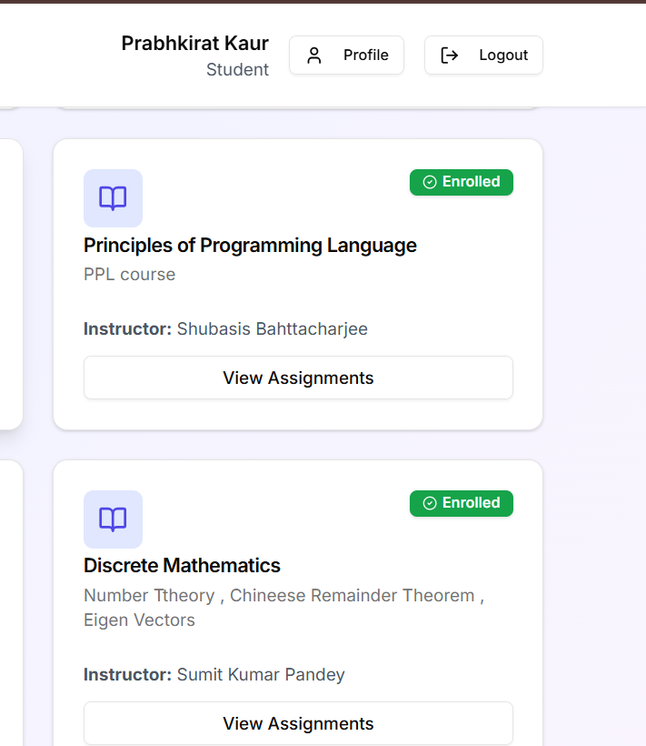
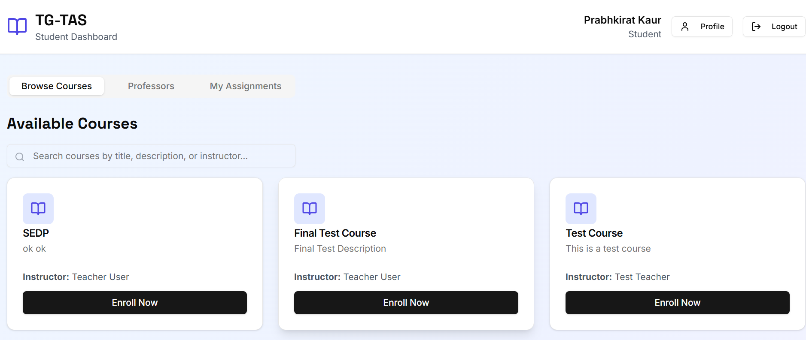
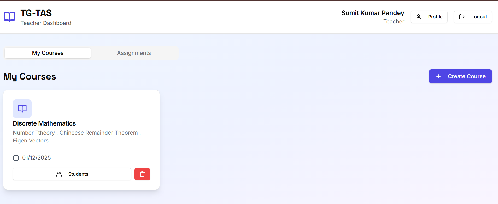
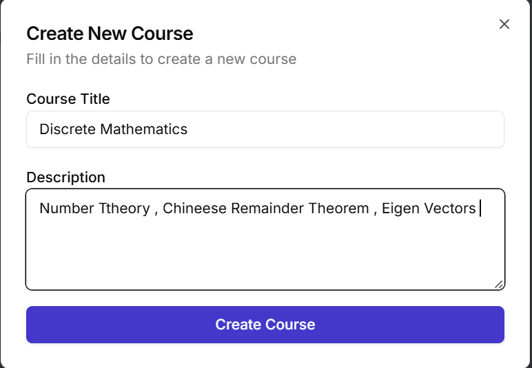
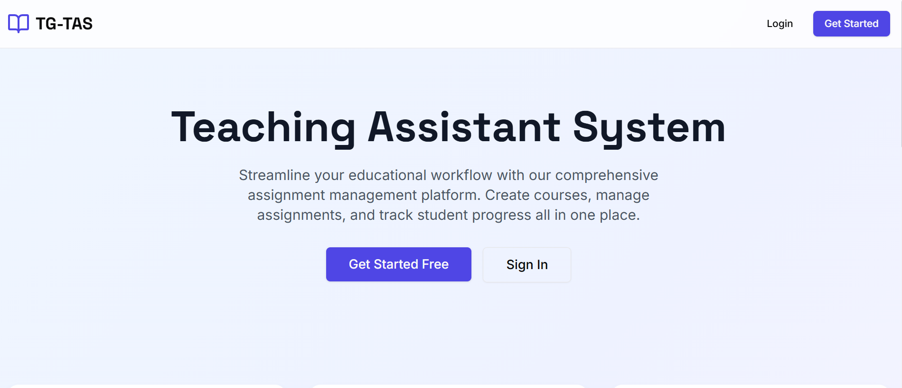

# TG-TAS: Teaching Assistant System

A comprehensive educational platform for managing courses, assignments, and student submissions. Built with FastAPI, React, and SQLite.

## Overview

TG-TAS is a working prototype that enables teachers to create courses and assignments, while students can enroll in courses, submit assignments, and receive grades with feedback.

### Key Features

**For Teachers:**
- Create and manage courses
- Create assignments with due dates and point values
- View all student submissions
- Grade submissions with detailed feedback
- Track student progress

**For Students:**
- Browse and enroll in available courses
- View course assignments
- Submit assignments (file upload)
- View grades and teacher feedback
- Track submission status

## Technology Stack

- **Backend:** FastAPI (Python)
- **Frontend:** React
- **Database:** SQLite
- **Authentication:** JWT (JSON Web Tokens)
- **UI Components:** Tailwind CSS

## Prerequisites

- Python 3.8+
- Node.js and npm

## Setup Instructions

### 1. Backend Setup

It is recommended to use a virtual environment.

```bash
# Navigate to project root
cd Teaching-Assistant

# Create virtual environment
python -m venv .venv

# Activate virtual environment
# Windows:
.\.venv\Scripts\Activate
# Mac/Linux:
source .venv/bin/activate

# Install dependencies
pip install -r backend/requirements.txt

# Start the server
python backend/server.py
```

The backend runs on `http://localhost:8001`.

### 2. Frontend Setup

```bash
# Navigate to frontend directory
cd frontend

# Install dependencies
npm install

# Start the development server
npm start
```

The frontend runs on `http://localhost:3000` (or 3002 if 3000 is busy).

## API Endpoints

### Authentication
- `POST /api/auth/register` - Register new user
- `POST /api/auth/login` - Login
- `GET /api/auth/me` - Get current user info

### Courses
- `POST /api/courses` - Create course (Teacher)
- `GET /api/courses` - List courses
- `POST /api/courses/{course_id}/enroll` - Enroll (Student)

### Assignments
- `POST /api/assignments` - Create assignment (Teacher)
- `GET /api/courses/{course_id}/assignments` - List assignments

### Submissions
- `POST /api/assignments/{assignment_id}/submit` - Submit assignment (Student)
- `PUT /api/submissions/{submission_id}/grade` - Grade submission (Teacher)

## Authentication

The system uses JWT token-based authentication.
1. User registers/logs in.
2. Server returns a JWT token.
3. Token is stored in the frontend.
4. Token is sent in the `Authorization` header for protected requests.

## Project Structure

```
Teaching-Assistant/
├── backend/
│   ├── server.py           # Main application logic
│   ├── requirements.txt    # Python dependencies
│   ├── test_cfg_functions.py # Unit tests
│   └── uploads/            # Stored assignment files
│
├── frontend/
│   ├── src/                # React source code
│   ├── public/             # Static assets
│   └── package.json        # Node dependencies
│
└── README.md               # Project documentation
```

## Testing

The project includes unit tests for the backend.

```bash
# Run all tests
python backend/test_cfg_functions.py
```

## License

Educational prototype.

## Screenshots

### Dashboard


### Course View


### Assignment Details


### Submission Interface


### Grading View

